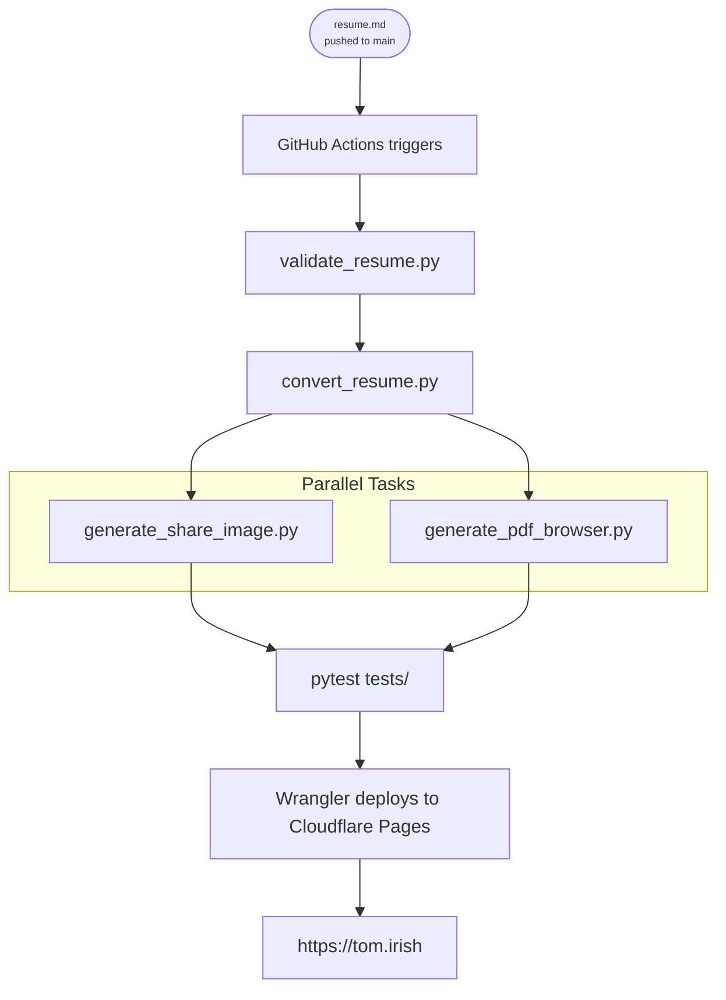

# Tom Irish - Personal Website

[](https://tom.irish)
[](https://cloudflare.com)
[](https://github.com/tomirish/tom.irish/actions/workflows/build.yml)

[](https://developer.mozilla.org/en-US/docs/Web/HTML)
[](https://developer.mozilla.org/en-US/docs/Web/CSS)
[](https://www.python.org/)
[](https://www.markdownguide.org/)
[](https://github.com/features/actions)
[](https://playwright.dev/)

Personal website and resume for [Tom Irish](https://tom.irish) — a clean, single-page design driven entirely by Markdown.

---

## How It Works

Edit [`resume.md`](resume.md), commit to `main`, and the site and PDF update automatically:

```
resume.md pushed to main
       ↓
GitHub Actions triggers
       ↓
validate_resume.py      — checks format and required sections
convert_resume.py       — updates index.html from resume.md
generate_pdf_browser.py — generates resume.pdf via headless Chromium  ┐ parallel
generate_share_image.py — regenerates OG preview image                ┘
pytest tests/           — verifies scripts and templates
       ↓
Wrangler deploys to Cloudflare Pages → https://tom.irish
```


    
---

## Files

| File | Purpose | Edit? |
|------|---------|-------|
| `resume.md` | Resume content | ✅ Yes |
| `index.template.html` | Web page template | ✅ Yes — layout or structure |
| `resume.template.html` | PDF template | ✅ Yes — PDF layout or structure |
| `assets/` | CSS and images | ✅ Yes — styling |
| `docs/EDITING.md` | How to edit resume.md | 📖 Reference |
| `docs/CUSTOMIZING.md` | Style and design reference | 📖 Reference |
| `scripts/` | Build automation | 🔧 Pipeline changes only |
| `tests/` | Test suite | 🔧 Pipeline changes only |
| `.github/workflows/build.yml` | CI/CD config | 🔧 Automation changes only |

---

## Docs

- **[EDITING.md](docs/EDITING.md)** — format reference for `resume.md`: required sections, field formats, section-by-section examples
- **[CUSTOMIZING.md](docs/CUSTOMIZING.md)** — style reference: typography, color, layout, components, and design intent
