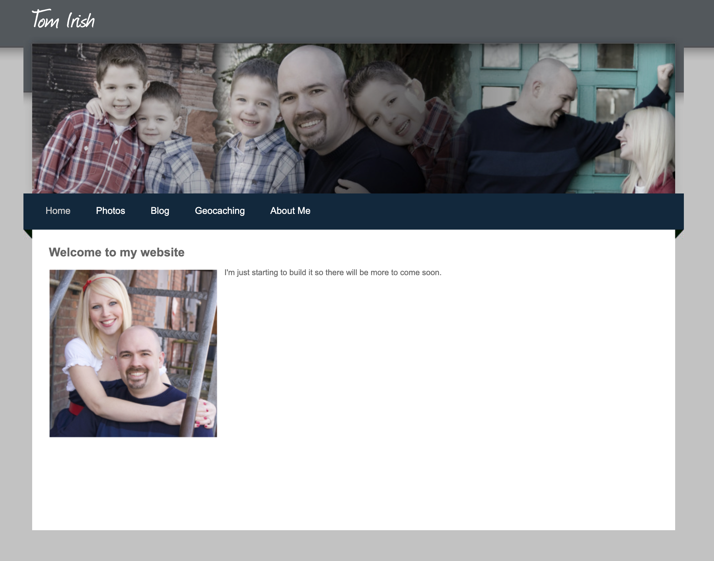
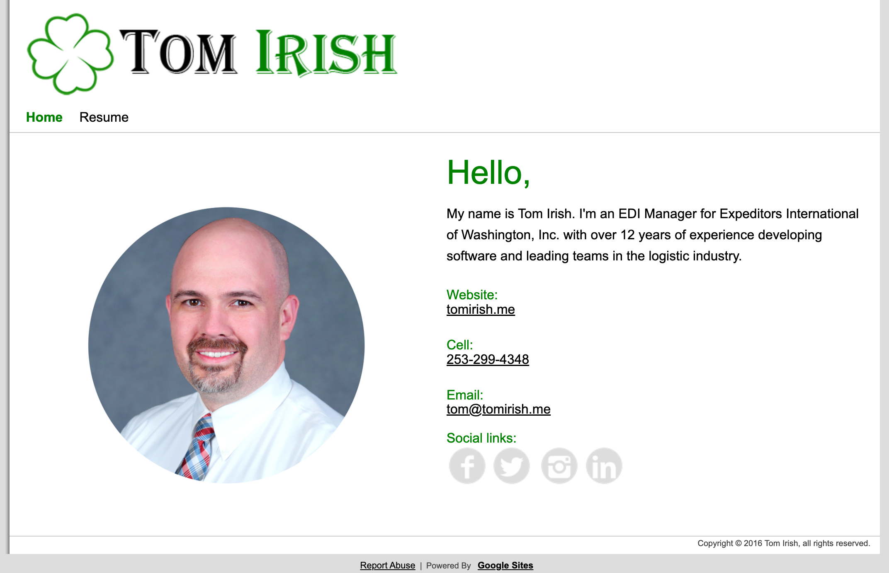
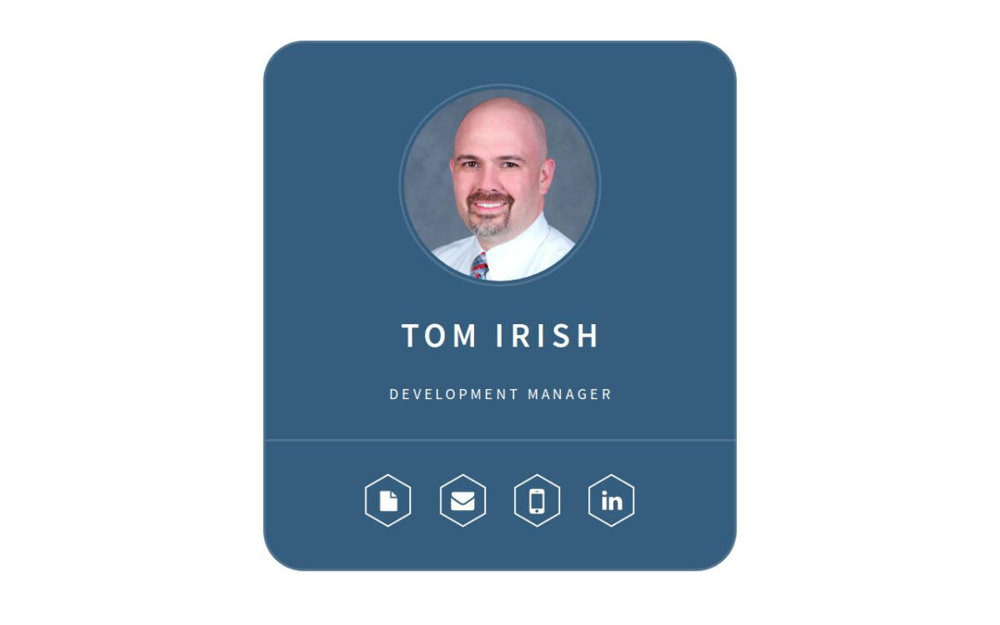
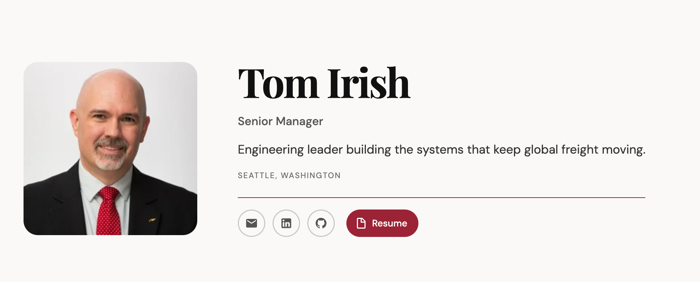

# Design History

A visual record of every major redesign of Tom Irish's personal website since 2013.

| Version | Year | Platform | Domain |
|---|---|---|---|
| [v1](#v1--2013) | 2013 | Weebly | tomirish.me |
| [v2](#v2--2015) | 2015 | Google Sites | tomirish.me |
| [v3](#v3--2018) | 2018 | Google Sites | tomirish.me |
| [v4](#v4--2019) | 2019 | Carrd.co | tom.irish |
| [v5](#v5--2024) | 2024 | Carrd.co | tom.irish |
| [v6](#v6--2025) | 2025 | Carrd.co | tom.irish |
| [v7](#v7--2026) | 2026 | Custom (GitHub + Cloudflare Pages) | tom.irish |

---

## v1 — 2013

Personal/family site built on Weebly. Cursive "Tom Irish" logo, full-width family photo banner, dark navy navigation bar. Content covered family life: Home, Photos, Blog, Geocaching, About Me. The first iteration of tomirish.me.

---

## v2 — 2015

Moved to Google Sites with a professional focus. Shamrock logo, bold green "TOM IRISH" wordmark, white background, circular headshot, social icon row. Navigation reduced to Home and Resume.

---

## v3 — 2018

Redesign within Google Sites. Shamrock logo dropped, green accent reduced to thin rule lines top and bottom, serif headline type, two-column layout with circular headshot. Cleaner and more restrained than v2.

---

## v4 — 2019

Moved to Carrd.co and the tom.irish domain. White background, wide-spaced caps typography, steel blue accent, circular headshot centered on the page. Navigation as pill-shaped outline buttons. Minimal and modern.

---

## v5 — 2024

Redesigned within Carrd.co. Steel blue card with rounded corners, hexagon social icon row. Moodier and more graphic than v4.

---

## v6 — 2025

Second Carrd.co card design. Dark charcoal background, new headshot (suit, red tie), hexagon icons filled with glyphs (resume, email, phone, LinkedIn).

---

## v7 — 2026

Complete departure from the card format. First fully custom-built version — Markdown-driven pipeline, deployed via GitHub Actions to Cloudflare Pages. Editorial serif name (Playfair Display), rounded photo left-aligned, crimson accent rule and Resume button, off-white background.
